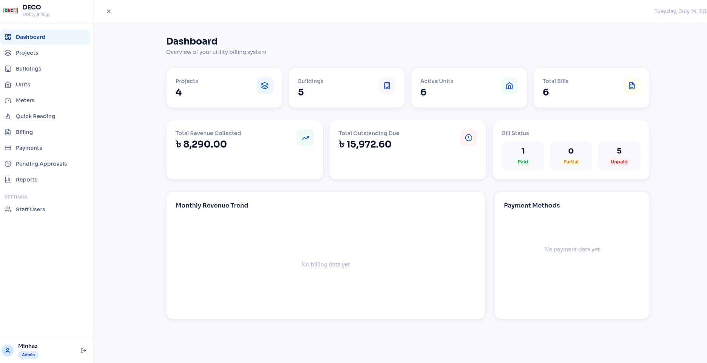
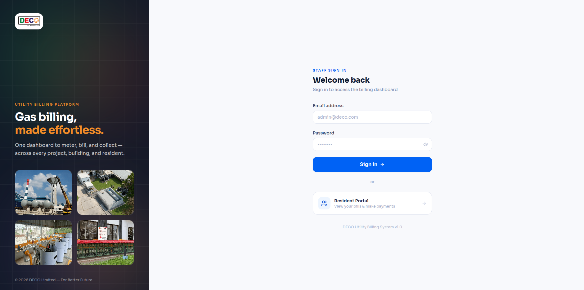
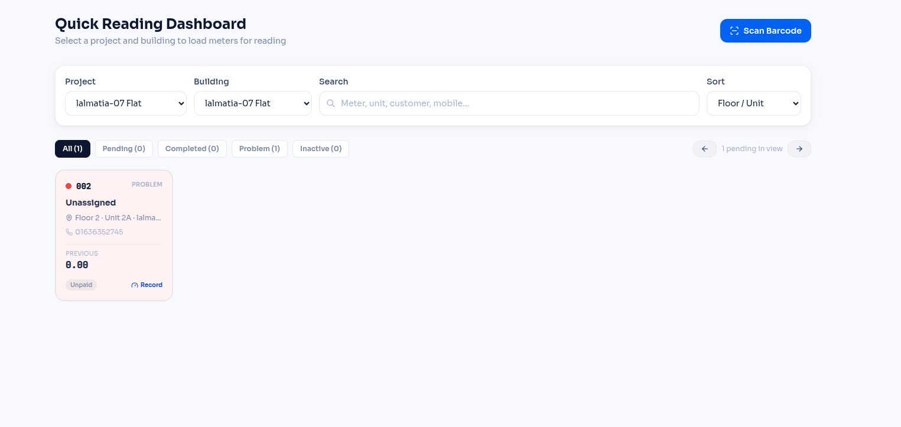

# 🔥 DECO — Utility Billing System

A full-stack DECO Utility Billing Management System built with **Django REST Framework** (backend) and **React + Vite + TypeScript** (frontend), with a Tailwind CSS UI.

---
## System Images





## 📁 Project Structure

```
gas-billing-system/
├── backend/                      # Django REST API
│   ├── gas_billing/               # Django project settings & urls
│   ├── core/                      # Cross-app shared code
│   │   ├── permissions.py         # All RBAC permission classes (single source of truth)
│   │   ├── rbac.py                # Per-role default module permissions
│   │   ├── pagination.py
│   │   └── exceptions.py
│   ├── apps/
│   │   ├── authentication/        # Staff login (JWT), Customer OTP, Roles, per-user overrides
│   │   ├── projects/               # Projects & Pricing Packages (incl. m³→Kg conversion ratio)
│   │   ├── buildings/              # Buildings under projects
│   │   ├── units/                  # Units, Floors, Allottees (meter shown/assigned from here)
│   │   ├── meters/                 # Meters, readings, Quick Reading Dashboard, barcode lookup
│   │   ├── billing/                # Bill creation, spreadsheet edit, bulk creation
│   │   ├── payments/                # Payments, approval workflow, payment channel settings
│   │   ├── reports/                 # Revenue analytics + Excel export endpoints
│   │   │   └── exports/             # openpyxl export builders (generic + formula-linked)
│   │   ├── audit/                   # Full audit trail (staff- and customer-attributed)
│   │   └── portal/                  # Customer portal views (no models of its own)
│   ├── Dockerfile
│   ├── requirements.txt
│   └── manage.py
│
├── frontend/                      # React 18 + TypeScript + Vite
│   ├── src/
│   │   ├── api/                    # Axios clients — separate staff and customer-portal clients,
│   │   │                             each with their own JWT pair and auto-refresh
│   │   ├── components/
│   │   │   ├── layout/              # AppLayout (staff), PortalLayout (customer)
│   │   │   ├── ui/                  # Shared Modal (focus trap, scroll lock, Esc-to-close), Badge,
│   │   │   │                          Pagination, Spinner, ConfirmDialog, AccessDenied, etc.
│   │   │   ├── meters/              # MeterCard, ReadingModal, BarcodeScanner, MeterAssignModal
│   │   │   └── payments/            # PaymentModal, PaymentChannelsCard, BkashComingSoon
│   │   ├── pages/
│   │   │   ├── auth/                 # Staff login
│   │   │   ├── dashboard/
│   │   │   ├── projects/             # Project & Package CRUD (incl. conversion ratio)
│   │   │   ├── buildings/
│   │   │   ├── units/                 # Unit + Allottee + Meter assignment (consolidated)
│   │   │   ├── meters/                # Meter Readings history + Quick Reading Dashboard
│   │   │   ├── billing/               # List/Spreadsheet/Bulk-create/Detail
│   │   │   ├── payments/              # Payments list, Pending Approvals queue
│   │   │   ├── reports/               # Charts & revenue reports, financial-gated per role
│   │   │   ├── settings/              # Staff, Roles & RBAC (live matrix), Payment Channels
│   │   │   └── portal/                # Customer portal (dashboard, bills, payment, profile)
│   │   ├── hooks/                     # usePermissions (role → capability flags)
│   │   ├── store/                     # Zustand: separate staff and customer auth stores
│   │   └── utils/
│   ├── Dockerfile
│   ├── nginx.conf
│   └── package.json
│
├── docs/
│   └── schema.sql                # Full PostgreSQL schema reference
├── scripts/
│   └── setup.sh                  # One-command setup script
└── docker-compose.yml            # Full stack Docker setup
```

---

## 🚀 Quick Start

### Option A — Local Development

```bash
# 1. Setup everything at once
chmod +x scripts/setup.sh && ./scripts/setup.sh

# 2a. Start backend
cd backend
source venv/bin/activate
python manage.py migrate
python manage.py runserver

# 2b. Start frontend (new terminal)
cd frontend
npm install
npm run dev
```

### Option B — Docker Compose

```bash
cp backend/.env.example backend/.env   # Edit secrets
docker compose up --build
```

**Access:**
- 🌐 Frontend: http://localhost:5173
- 🔌 API: http://localhost:8000/api/v1/
- 🔑 Default admin: `admin@gasbill.com` / `Admin@1234` (**development only** — change before any shared or production deployment)

---

## 🌟 Features

### Core Billing
- ✅ Multi-project, multi-building, multi-unit billing hierarchy
- ✅ Gas bill creation with m³ meter readings; bills on Kg when a package defines a conversion ratio
- ✅ Automatic server-side bill calculation (usage × unit price + charges − discounts) — never trusts client-submitted totals
- ✅ Bill adjustments with mandatory audit reason (Billing Officer)
- ✅ Partial payments — bills auto-update to Partial/Paid status
- ✅ **Automatic Billing from Package** — selecting a Project auto-fills unit price, service charge, and conversion ratio from its default Package
- ✅ **Spreadsheet Billing** — inline-editable list view (Super Admin/Admin) with per-field dirty-state, live previous/new/diff totals, and per-row save
- ✅ **Bulk Bill Creation** — generate bills for every active unit in a building at once, using already-recorded meter readings; skipped units (already billed / no reading yet) are reported by name

### Meter Reading
- ✅ **Quick Reading Dashboard** — grid of meter cards per building, color-coded by status (Pending/Completed/Problem/Inactive), with keyboard-friendly bulk entry and auto-advance to the next pending meter
- ✅ **Barcode / QR scan-to-select** — camera scan resolves directly to a meter and pre-fills the reading form
- ✅ Meter assignment lives on the Units page (one action, handles both assigning a new meter and editing an existing one) — no more duplicate/disconnected meter-number entry points

### Payments
- ✅ Cash, Bank Transfer, bKash, Card, SSLCommerz methods
- ✅ **Customer Portal Payment** — proof-based submission (screenshot/invoice), held as Pending until reviewed; does not touch the bill balance until approved
- ✅ **Accountant Payment Approval Queue** — Approve (atomically applies to the bill) or Reject (with required remarks)
- ✅ **Manual Payment Entry** — staff-recorded payments require proof + transaction ID, auto-approved
- ✅ **Payment Channel Settings** — Super Admin-configurable bKash/Nagad/Bank details shown to customers before they pay; online bKash checkout is clearly marked "Coming Soon" rather than a non-functional button
- ✅ Live "Previous Paid / Previous Due / Remaining Due" calculation while entering any payment, with over-payment blocked client-side
- ✅ Transaction ID tracking per payment; atomic payment application (DB transaction ensures consistency)

### User Management & RBAC
- ✅ JWT authentication for staff (8h access + 7d refresh) — **separate** JWT authentication class and token shape for the customer portal
- ✅ OTP via mobile for customer portal login
- ✅ 5 role types: `super_admin`, `admin`, `billing_staff`, `accountant`, `viewer` — Viewer is genuinely read-only across Projects, Buildings/Units, Meters, Billing, Payments, and Reports
- ✅ **Live Roles & RBAC permission matrix** — computed by calling the actual backend permission classes per role, not a hand-maintained table that can silently go stale
- ✅ Token blacklist on logout
- ⚠️ A per-user granular permission override system exists in the data model and UI but is **not currently enforced** — role alone determines access today; the UI states this explicitly

### Reports & Analytics
- ✅ Monthly revenue trend charts, revenue breakdown by project/building
- ✅ Outstanding bills tracker
- ✅ Payment method distribution
- ✅ Financial-only widgets are gated per role in the UI (no failed-request errors for roles that can view Reports but not financial totals)

### Excel Export
- ✅ Filter-aware Billing export (status, project, building, unit, search, date range) and Payments export (status, source, method, date range)
- ✅ Building/Unit workbook export: one master "Building Summary" sheet plus one linked sheet per unit, where every unit-sheet cell is a live Excel formula referencing the summary sheet

### Audit & Compliance
- ✅ Full audit log on every CREATE/UPDATE/DELETE, storing old + new JSON snapshots
- ✅ Attributes actions to either a staff member or a customer (e.g. a portal payment submission), not just staff

### UI/UX
- ✅ One shared Modal implementation across the entire system — bounded height with internal scroll, background scroll lock, keyboard focus trap, Escape-to-close

---

## 🔌 API Reference

| Endpoint | Methods | Description |
|---|---|---|
| `/api/v1/auth/login/` | POST | Staff JWT login |
| `/api/v1/auth/otp/request/` | POST | Customer OTP request |
| `/api/v1/auth/otp/verify/` | POST | Customer OTP verify |
| `/api/v1/auth/staff/` | GET, POST | List/create staff users |
| `/api/v1/auth/staff/{id}/` | GET, PATCH, DELETE | Staff user detail |
| `/api/v1/auth/staff/{id}/permissions/` | GET, PUT | Per-user permission overrides (not yet enforced) |
| `/api/v1/auth/roles/` | GET | Roles (RBAC management) |
| `/api/v1/auth/roles/dropdown/` | GET | Roles for form dropdowns |
| `/api/v1/auth/roles/permission-matrix/` | GET | Live role × module permission matrix |
| `/api/v1/projects/` | GET, POST | List/create projects |
| `/api/v1/projects/packages/` | GET, POST | Pricing packages (incl. conversion ratio) |
| `/api/v1/buildings/` | GET, POST | Buildings |
| `/api/v1/units/` | GET, POST | Units with allottees and linked meter |
| `/api/v1/meters/` | GET, POST | Meter assignments |
| `/api/v1/meters/{id}/` | GET, PATCH | Meter detail / edit |
| `/api/v1/meters/readings/` | GET, POST | Meter readings |
| `/api/v1/meters/quick-dashboard/` | GET | Quick Reading Dashboard cards for a building |
| `/api/v1/meters/lookup-barcode/` | GET | Resolve a scanned barcode/QR to a meter |
| `/api/v1/billing/` | GET, POST | Bills |
| `/api/v1/billing/{id}/` | GET, PATCH, DELETE | Bill detail |
| `/api/v1/billing/{id}/quick-edit/` | PATCH | Spreadsheet inline save (Super Admin/Admin) |
| `/api/v1/billing/bulk-create/` | POST | Bulk-create bills for a building/month |
| `/api/v1/billing/summary/` | GET | Bill KPI summary |
| `/api/v1/payments/` | GET, POST | Record / list payments |
| `/api/v1/payments/pending/` | GET | Pending customer-submitted payments |
| `/api/v1/payments/{id}/approve/` | POST | Approve a pending payment |
| `/api/v1/payments/{id}/reject/` | POST | Reject a pending payment |
| `/api/v1/payments/channel-settings/` | GET, PUT | bKash/Nagad/Bank details |
| `/api/v1/portal/payments/submit/` | POST | Customer proof-based payment submission |
| `/api/v1/portal/payment-channels/` | GET | Read-only channel details for the portal |
| `/api/v1/reports/dashboard/` | GET | Dashboard stats |
| `/api/v1/reports/monthly-revenue/` | GET | Monthly trend (financial-gated) |
| `/api/v1/reports/unpaid-bills/` | GET | Outstanding bills |
| `/api/v1/reports/export/bills/` | GET | Filter-aware Billing Excel export |
| `/api/v1/reports/export/payments/` | GET | Filter-aware Payments Excel export |
| `/api/v1/reports/export/building/{id}/` | GET | Formula-linked Building/Unit workbook |
| `/api/v1/audit/` | GET | Audit log (Super Admin only) |

---

## 🛡️ Security Notes

- Never commit `.env` — change `SECRET_KEY` in production
- Disable `DEBUG` in production
- Set `ALLOWED_HOSTS` and `CORS_ALLOWED_ORIGINS` appropriately
- The OTP endpoint returns the OTP in the response only when `DEBUG=True` — confirm this is `False` in any shared/production environment
- Every view declares its `permission_classes` explicitly — an earlier audit found Project/Package management endpoints relying on the global authenticated-user default rather than their intended role-specific permission class; this has been fixed, and every view should continue to declare its permission class explicitly rather than relying on the default
- The customer portal uses a distinct JWT authentication class and token shape from staff sessions; the two auth stores (frontend) and token pairs are kept independent so a failure in one can't collaterally log out the other
- Payment proof uploads (screenshots, invoices/PDFs) are stored under `media/payment_proofs/`; meter reading photos under `media/meter_readings/` — both are gitignored and excluded from version control

---

## 🏗️ Tech Stack

| Layer | Technology |
|---|---|
| Backend | Python 3.11, Django 4.2, DRF 3.14 |
| Auth | JWT (`djangorestframework-simplejwt`, with token blacklist) — separate staff and customer-portal authentication classes |
| Database | PostgreSQL |
| Filtering | django-filter |
| Excel Export | openpyxl |
| PDF (customer invoices) | reportlab |
| Images | Pillow |
| Cache / Queue | Redis, Celery (configured; not yet wired to a background task) |
| Frontend | React 18, TypeScript, Vite 5 |
| Routing | React Router v6 |
| Server State | **TanStack Query v5** (all API data fetching/caching/mutation) |
| Client State | **Zustand** (`persist` middleware) — separate stores for staff and customer sessions |
| Forms | react-hook-form |
| UI | Tailwind CSS, Recharts, Lucide icons |
| Barcode/QR | html5-qrcode |
| Deploy | Docker, Nginx, Gunicorn |